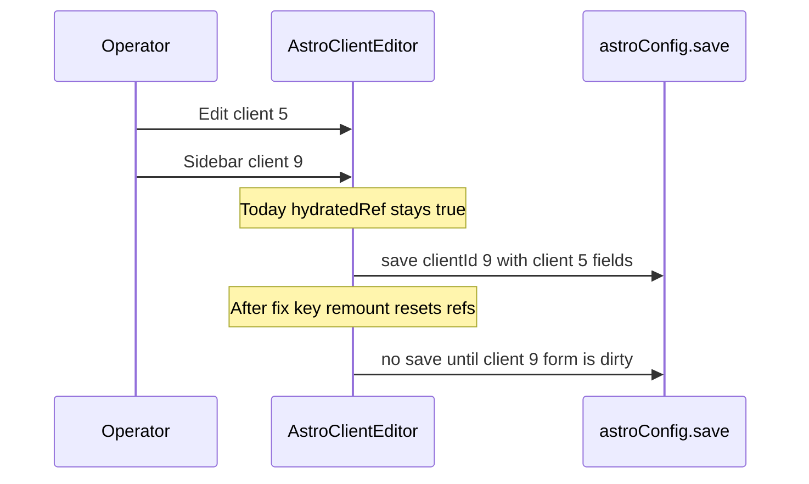
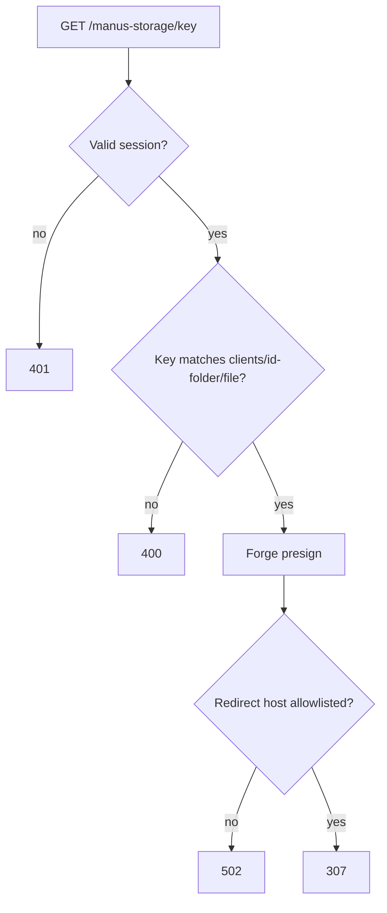
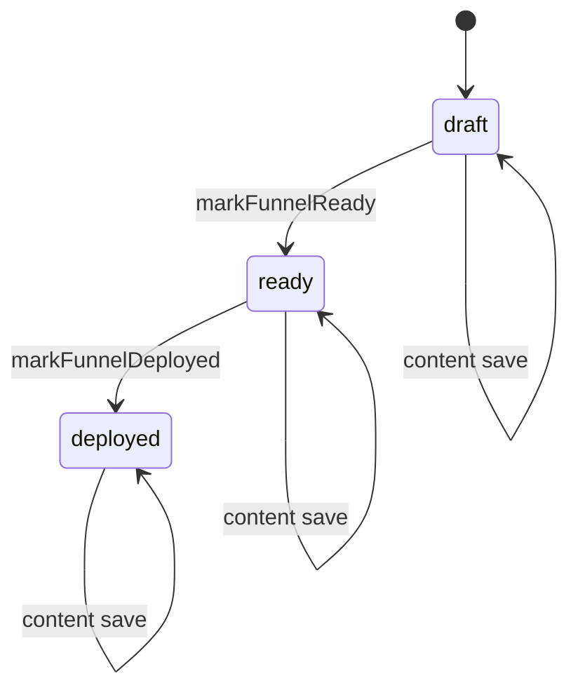
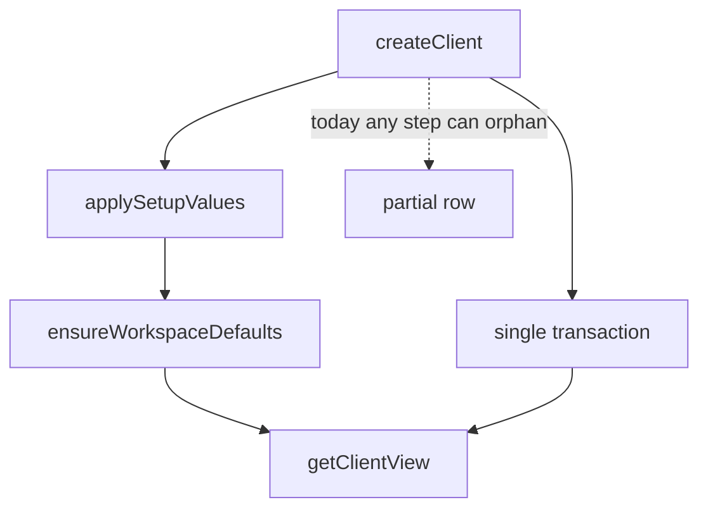

# Fix Launchpad Audit Potholes - Plan

**Target repo:** `site-launchpad-source` (durable home copy of the audited zip).
**Product Contract preservation:** bootstrap from the 2026-08-13 zip audit. No prior unified plan.
**Executor:** Claude Opus 4.6 in Cowork (see Cowork Execution Contract). Codex stays read-only review after each wave.

## Goal Capsule

- **Objective:** Close every audit finding #1–#38 in `site-launchpad-source` so one operator action cannot corrupt another client, saved secrets never return in the clear, unauthenticated storage reads fail, and login/JWT/persistence fail closed. Do not implement the six validator-dropped items.
- **Authority:** this plan > `docs/audit/adversarial-review-brief.md` > `docs/audit/2026-08-13-code-review-report.md` > current code.
- **Priority mapping:** Cowork **P1** = audit P0 (critical). Cowork **P2** = audit P1 (high). Cowork **P3** = audit P2 (moderate) plus documented skips.
- **Stop:** P1 tests fail; a settled decision is invalidated; production deploy, spend, or a protected-client write is requested.
- **Out of scope:** implementing code in the planning session; CSRF cookie rewrite; DRY-only upload refactors; nested deploy JSON; enum already shipped in 0004.

---

## Product Contract

### Summary

Internal multi-client launchpad. Authenticated operators persist client, Astro, and funnel config, encrypt Wrangler/GHL secrets, upload assets, and generate `client.config.ts` / `funnel.config.ts`. Launch and funnel deploy are server-gated. Secrets must never return after save. A user action must not corrupt another client's data.

### Problem Frame

The zip audit verdict is **Not ready**. Highest-impact bug: Settings client-switch writes Client A onto Client B. Independent Codex agreed on storage proxy, login-without-DB, decrypted funnel secrets, shared-tenant mutation, lost autosaves, and several races. Validator dropped six items as false or preference. Those stay in the checklist as skip rows so Cowork does not "fix" them.

### Requirements

**Isolation and editor state**

- R1. Switching the sidebar client must remount or fully reset every editor so Client A's draft cannot save as Client B. Governs #1, #37.
- R2. In-flight autosave must not drop later keystrokes. Governs #8, #38.
- R3. Deploy and refetch must not clobber a dirty form. Governs #24.

**Auth, privilege, storage**

- R4. Empty or missing `JWT_SECRET` must refuse to sign or verify sessions. Governs #7.
- R5. OAuth must not set a session cookie unless the user row persisted. Governs #3.
- R6. `GET /manus-storage/*` requires a session, allowlisted keys, and no 307 to an unexpected host. Governs #2.
- R7. This app is a shared-tenant ops tool: any authenticated operator may list and edit every client. Launch, funnel deploy, and mark-deployed require `adminProcedure`. Funnel mutations already must load via `getOwnedFunnel(clientId, funnelId)`. Governs #5.

**Secrets**

- R8. After save, APIs return presence flags only. Decrypt only on the server when generating configs. Governs #4, #28, #12.
- R9. AES-256-GCM uses a dedicated versioned `SECRETS_ENCRYPTION_KEY`, not `JWT_SECRET`. Governs #14.

**Persistence integrity**

- R10. Client row updates are optimistic on `updatedAt` or field patches, not blind full-row last-write-wins. Governs #15.
- R11. Funnel content save must not reset `deploymentStatus` or deploy timestamps. Governs #16.
- R12. Client create (row + secrets + workspace defaults) is one transaction. Governs #18.
- R13. First secret-row insert uses upsert, not get-then-insert. Governs #33.
- R14. Concurrent `ensureWorkspaceDefaults` must not fail unique inserts. Governs #35.
- R15. S3 PUT then DB upsert must compensate or use immutable keys so bytes and metadata cannot diverge. Governs #32, #34.

**Readiness and schema**

- R16. First Settings autosave must not persist `productCategories: []` from all-disabled defaults. Governs #13.
- R17. Astro hours schema requires seven unique weekdays, matching launch. Governs #36.
- R18. Existing funnels with `status` ready/live must backfill `deploymentStatus`. Governs #26.
- R19. Commit Drizzle journal/snapshots. Do not `generate && migrate` on every apply. Governs #11.

**Errors, uploads, maintainability**

- R20. Preserve `TRPCError` codes. Map not-found to `NOT_FOUND`, not `BAD_REQUEST`. Governs #22, #30.
- R21. Forge/S3 `fetch` uses a timeout. Governs #23.
- R22. Stop 30MB dataUrl uploads. Bound sharp work. Governs #31, #29.
- R23. Canonical settings is `/workspace/:clientId/settings`. `/clients/:clientId` redirects there. `/clients/new` stays create-only. Governs #25.
- R24. Split `ClientEditor.tsx`. Delete unrouted `ComponentShowcase.tsx` and unused showcase-only imports. Governs #9, #10.
- R25. `clients.list` must not N+1 `getClientView`. Governs #17.

### Actors

- A1. Authenticated operator (role `user`).
- A2. Admin operator (`OWNER_OPEN_ID` promoted in `upsertUser`).
- A3. Unauthenticated caller.

### Key Flows

- F1. Settings client switch. **Trigger:** sidebar changes `clientId` while Settings is dirty. **Outcome:** no write of A onto B; editor remounts. Covers R1, R2.
- F2. Login. **Trigger:** OAuth callback. **Outcome:** cookie only after user persist; missing `JWT_SECRET` or DB fails closed. Covers R4, R5.
- F3. Asset read. **Trigger:** `GET /manus-storage/{key}`. **Outcome:** 401 without session; 403/400 on bad key; 307 only to allowlisted host. Covers R6.
- F4. Secret save then get. **Trigger:** save pixel/webhook/Wrangler secrets, then get. **Outcome:** JSON has flags, not plaintext. Covers R8.
- F5. Funnel deploy with dirty form. **Trigger:** Deploy while copy changed. **Outcome:** save-or-block first; deployed status survives later content save. Covers R3, R11.

### Acceptance Examples

- AE1. Covers F1 / R1. Given Settings open on client 5 with dirty `businessName`. When the sidebar selects client 9. Then no `astroConfig.save` for client 9 contains client 5 fields, and the form shows client 9.
- AE2. Covers F3 / R6. Given no session cookie. When `GET /manus-storage/clients/5-acme/hero.webp`. Then 401 and no Forge presign.
- AE3. Covers F4 / R8. Given saved `metaPixelId`. When `funnelBuilder.get`. Then body has a presence flag and does not contain the pixel string.
- AE4. Covers F2 / R5. Given `DATABASE_URL` unset. When OAuth callback completes. Then no `app_session_id` cookie and the handler errors.

### Success Criteria

- `pnpm test` and `pnpm check` pass.
- Every non-skip checklist row has a test or an explicit smoke path.
- P1 items #1, #2, #3, #4, #7 are proven by automated tests before P2 starts.

### Scope Boundaries

**In scope:** audit #1–#38 as fix or documented skip; adversarial-brief divisions 1–8.

**Deferred to follow-up:** clearing a saved secret to empty; `clients.status` `live`/`issue` vs launch writing `ready`; Manus `_core` unmounted LLM/voice SSRF; `sanitizeClientFolder` S3 prefix collision hardening beyond immutable upload keys.

**Outside this product's identity:** public multi-tenant SaaS with per-user ownership rows; Cloudflare production deploy from this repo.

**Do not implement (validator-dropped):** #6, #19, #20, #21, #27, #39. Checklist skip rows stay so Cowork does not reopen them.

### Key Decisions

- KD1. Shared-tenant ops, not per-operator ownership. Governs R7.
- KD2. Dedicated versioned data-encryption key. Governs R9.
- KD3. One settings editor: Astro workspace settings. Governs R23.
- KD4. Apply `docs/audit/adversarial-review-brief.md` throughout. Governs R1–R8, R10, R15.

---

## Planning Contract

### Assumptions

- Internal operators sharing all clients is intended. The remaining #5 work is admin-gating irreversible actions plus tests, not a new ownership table.
- Existing ciphertext was encrypted with SHA-256(`JWT_SECRET`). Migration decrypts with the legacy key and re-encrypts with `SECRETS_ENCRYPTION_KEY` on next write. Reads try versioned key first, then legacy.
- Storage `` is same-origin, so Lax session cookies are sent after R6.
- Cowork runs in this durable home copy, not `/tmp`.

### Key Technical Decisions

- KTD1. Remount editors with React `key={clientId}` and reset hydration refs. `(session-settled: user-directed — chosen over leaving Settings mounted across client switches: audit #1 is the highest-impact overwrite.)` Instantiates R1.
- KTD2. Fail closed on `JWT_SECRET` the same way `getEncryptionKey()` already fails on a short secret. Instantiates R4.
- KTD3. Storage proxy: require session via existing cookie verify; allow keys matching `^clients/\d+-[^/]+/`; allowlist redirect hostnames (Forge/S3). Instantiates R6.
- KTD4. Wire redaction: `getFunnelBuilderDetail` / `getAstroConfig` return `hasMetaPixelId` / `secretStatus` / generated-config presence or a non-secret preview, never decrypted pixel, webhook, or Wrangler values. Server-side generation still decrypts. Instantiates R8.
- KTD5. Keep `protectedProcedure` for list/get/save. Switch `clients.launch`, `funnelBuilder.deploy`, and `funnelBuilder.markDeployed` to `adminProcedure`. Instantiates R7. `(session-settled: user-directed — chosen over silent IDOR rewrite of the whole API: the brief required a tenant decision, not pretending this is accidental IDOR.)`
- KTD6. Introduce `SECRETS_ENCRYPTION_KEY` with a ciphertext version prefix (`v1:`). Keep `JWT_SECRET` for cookies only. Instantiates R9.
- KTD7. Trailing autosave: if dirty while `isPending`, queue one more save of `configRef` after success. Instantiates R2.
- KTD8. `updateClient` requires `expectedUpdatedAt` or updates only provided columns; conflict returns `CONFLICT`. Instantiates R10.
- KTD9. `saveFunnelBuilder` updates content and generated ciphertext only. `markFunnelReady` / `markFunnelDeployed` own status fields. Instantiates R11.
- KTD10. `storagePutExact` becomes content-addressed or UUID-suffixed; DB stores the new key. Concurrent same-slot uploads cannot mix old bytes with new metadata. Instantiates R15.
- KTD11. `pnpm db:push` must stop chaining `generate && migrate`. Commit `drizzle/meta/_journal.json` plus snapshots. Add a follow-up SQL backfill for `deploymentStatus`. Instantiates R18, R19.
- KTD12. Canonical settings route is workspace Astro editor. `ClientEditor` remains create (`/clients/new`) and is split into modules, not deleted. Instantiates R23, R24.

### High-Level Technical Design

Client-switch overwrite (P1 #1):

Storage proxy (P1 #2):

Funnel status vs content save (P2 #16, #24):

Create-client partial write (P2 #18):

### Sequencing

1. P1 isolation and fail-closed auth (U1–U5). Stop if those tests fail.
2. P2 persistence, redaction follow-through, errors, uploads, settings canonicalization (U6, U7, U11, U8, U9, U10, U12, U14). U11 before U8 so the backfill SQL has a journal.
3. P3 remaining races (U13).
4. Skip rows: assert no code change for #6, #19, #20, #21, #27.

### Sources and Research

- `docs/audit/2026-08-13-code-review-report.md` — finding IDs, severity, validator drops.
- `docs/audit/adversarial-review-brief.md` — eight risk divisions and cross-division interactions.
- Local patterns: `getOwnedFunnel`, `secretStatus` on Astro get, `getEncryptionKey()` fail-closed, Drizzle transactions in `astroConfigDb.ts` / `funnelConfigDb.ts`.
- No `solutions/` corpus. No web landscape scan. Implementation follows the brief plus existing fail-closed encrypt helper.

---

## Implementation Units

| U-ID | Title | Files touched | Depends-on |
|---|---|---|---|
| U1 | Remount Settings and trailing autosave | `client/src/App.tsx`, `AstroClientEditor.tsx` | — |
| U2 | Fail-closed JWT and login persist | `server/_core/env.ts`, `sdk.ts`, `oauth.ts`, `server/db.ts` | — |
| U3 | Authenticate storage proxy | `server/_core/storageProxy.ts`, `server/storage.ts` | U2 |
| U4 | Redact funnel and Astro secrets | `server/funnelConfigDb.ts`, `server/astroConfigDb.ts`, tests | — |
| U5 | Admin-gate launch/deploy | `server/routers/clients.ts`, `funnelBuilder.ts`, `trpc.ts` | U2 |
| U6 | Lost updates and dirty deploy | `server/db.ts`, `funnelConfigDb.ts`, `FunnelConfigEditor.tsx` | U1, U4 |
| U7 | Create transaction, secret upsert, list batch | `server/routers/clients.ts`, `server/db.ts`, `workspaceDb.ts` | — |
| U8 | Categories, hours, deployment backfill | `server/astroConfigDb.ts`, `shared/astroConfig.ts`, `drizzle/` | U11 |
| U9 | Error codes and fetch timeout | `server/routers/*.ts`, `server/storage.ts` | — |
| U10 | Dedicated encryption key | `server/clientSecurity.ts`, env | U4 |
| U11 | Drizzle journal | `drizzle.config.ts`, `package.json`, `drizzle/meta/` | — |
| U12 | Uploads: size, immutable keys, sharp bound | `server/routers/clients.ts`, `storage.ts`, `imageProcessing.ts` | U3 |
| U13 | Paid Ads reset and homepage persist | `PaidAdsWorkspace.tsx`, `WebsiteWorkspace.tsx` | U1 |
| U14 | Settings redirect, split editor, delete showcase | `App.tsx`, `ClientEditor.tsx`, `ComponentShowcase.tsx` | U1 |

### U1. Remount Settings editor and queue trailing autosave

**Goal:** Stop Client A from saving onto Client B, and stop dropped keystrokes during in-flight save.
**Requirements:** R1, R2. Checklist #1, #8.
**Dependencies:** none
**Files:** `client/src/App.tsx`, `client/src/pages/AstroClientEditor.tsx`, `client/src/pages/editorIsolation.test.ts` (new helper tests)
**Approach:**
1. Pass `key={clientId}` into `AstroClientEditor` (and later Paid Ads / Website in U13).
2. Reset `hydratedRef`, `dirtyRef`, drafts, and in-flight handlers when `clientId` changes even if key is also set.
3. If `saveNow` bails because `isPending`, keep `dirtyRef` true and run one trailing save on success from `configRef`.
**Patterns to follow:** `queryInput` already memoized on `clientId`.
**Test scenarios:**
- Covers AE1. Hydrate client 5, dirty the name, switch to 9: no save mutation uses client 5 payload with clientId 9.
- During `isPending`, type a second edit: after success a trailing save includes the later text.
- Clean switch with no dirty form: no extra save.
**Verification:** helper tests fail before the remount; pass after. Manual: two clients, Settings switch, confirm names.

### U2. Fail-closed JWT and refuse login without DB

**Goal:** Empty `JWT_SECRET` cannot mint sessions. Missing DB cannot look like a successful login.
**Requirements:** R4, R5. Checklist #7, #3.
**Dependencies:** none
**Files:** `server/_core/env.ts`, `server/_core/sdk.ts`, `server/_core/oauth.ts`, `server/db.ts`, `server/auth.logout.test.ts` (extend) or `server/auth.session.test.ts` (new)
**Approach:**
1. Resolve `cookieSecret` like `getEncryptionKey()`: throw if missing or empty.
2. `upsertUser` throws when `getDb()` is null instead of returning.
3. Confirm OAuth callback does not `res.cookie` if upsert throws (already in `try`).
4. Apply the same throw to `sdk.ts` upsert paths.
**Test scenarios:**
- Covers AE4. `upsertUser` with no `DATABASE_URL` throws; OAuth test double does not set cookie.
- `ENV.cookieSecret` empty throws at session sign/verify.
- Happy path: DB present, upsert then cookie.
**Verification:** new auth tests red then green. Existing logout tests still pass.

### U3. Authenticate and constrain the storage proxy

**Goal:** Unauthenticated callers cannot presign arbitrary keys. Redirects cannot leave the storage host.
**Requirements:** R6. Checklist #2.
**Dependencies:** U2
**Files:** `server/_core/storageProxy.ts`, `server/storage.test.ts` (extend) or `server/storageProxy.test.ts` (new)
**Approach:**
1. Verify session with the same cookie path as tRPC context.
2. Reject keys that are missing, contain `..`, or do not match `clients/{id}-{folder}/{file}`.
3. Parse Forge URL; 307 only if hostname is allowlisted.
4. Same-origin images keep working for logged-in operators (R6 assumption).
**Test scenarios:**
- Covers AE2. No cookie → 401, Forge fetch not called.
- Valid session + matching key → 307 to allowlisted host.
- Valid session + `../` or unmatched key → 400.
- Forge URL on unexpected host → 502, no redirect.
**Verification:** proxy tests cover the four cases. Authenticated UI still loads a known asset.

### U4. Redact funnel and Astro secrets on the wire

**Goal:** Get/save/deploy responses never include decrypted pixel, webhook, Wrangler, or generated secret-bearing files.
**Requirements:** R8. Checklist #4, #28, #12.
**Dependencies:** none
**Files:** `server/funnelConfigDb.ts`, `server/astroConfigDb.ts`, `server/funnelConfigDb.test.ts`, `server/astroConfigDb.test.ts`, `server/astroConfig.router.test.ts`, `server/funnelBuilder.router.test.ts`, UI types that read `generatedConfig` / `profile.metaPixelId`
**Approach:**
1. Stop calling `decryptOptional` into the client DTO. Return `hasMetaPixelId` / `hasGhlWebhookUrl` (funnel) and keep `secretStatus` (Astro).
2. Do not put decrypted `generatedConfig` on get. Return a non-secret preview or omit; decrypt only inside generate/deploy on the server.
3. Rewrite `astroConfig.router.test.ts` so the "no raw secrets" test hits real redaction, not a mock that already omitted secrets.
**Patterns to follow:** Astro `secretStatus` booleans.
**Test scenarios:**
- Covers AE3. Funnel get after save does not contain the pixel or webhook strings.
- Astro get does not contain decrypted generated file or Wrangler values.
- Router test fails if mock is the only reason secrets are absent; pass against real mapper.
- Generate/deploy on server still can read ciphertext.
**Verification:** db tests use real encrypt/decrypt helpers. Router test un-mocked for the mapper.

### U5. Admin-gate launch and deploy; keep shared-tenant edits

**Goal:** Record the tenant model in code. Irreversible launch/deploy require admin. Edits stay `protectedProcedure`.
**Requirements:** R7. Checklist #5.
**Dependencies:** U2
**Files:** `server/routers/clients.ts`, `server/routers/funnelBuilder.ts`, `server/clients.router.test.ts`, `server/funnelBuilder.router.test.ts`
**Approach:**
1. Do not add a `client_owners` table.
2. `launch`, `deploy`, `markDeployed` use `adminProcedure`.
3. Keep `getOwnedFunnel(clientId, funnelId)` on funnel writes.
4. Add `createCaller({ user: null })` unauthorized cases and a non-admin forbidden case for launch/deploy.
**Test scenarios:**
- Unauthenticated list/get/save → `UNAUTHORIZED`.
- Role `user` can save Astro/funnel content.
- Role `user` cannot `launch` or `deploy` → `FORBIDDEN`.
- Role `admin` can launch/deploy.
- Funnel save with mismatched `clientId`/`funnelId` → not found.
**Verification:** router tests with `user: null`, `{ role: "user" }`, `{ role: "admin" }`.

### U6. Optimistic client writes, preserve deployed, save-before-deploy

**Goal:** Concurrent editors do not silently overwrite. Content save does not undo deploy. Deploy uses the dirty form or refuses.
**Requirements:** R3, R10, R11. Checklist #15, #16, #24.
**Dependencies:** U1, U4
**Files:** `server/db.ts`, `server/funnelConfigDb.ts`, `server/funnelConfigDb.test.ts`, `client/src/components/funnels/FunnelConfigEditor.tsx`, `server/clients.router.test.ts`
**Approach:**
1. `updateClient` takes `expectedUpdatedAt`; zero rows → `CONFLICT`.
2. Remove `deploymentStatus: "draft"` and timestamp nulling from `saveFunnelBuilder`.
3. Deploy button saves first when dirty, or skips hydrate while dirty.
**Test scenarios:**
- Stale `expectedUpdatedAt` → conflict, no row change.
- Save on a `deployed` funnel leaves status `deployed`.
- Dirty funnel: deploy triggers save then mark-ready, or blocks with a message; hydrate does not reset dirty fields.
**Verification:** funnel db tests around status; editor dirty flag respected.

### U7. Transactional create, secret upsert, workspace unique race, batched list

**Goal:** Create-client cannot leave a row without secrets/workspace. First secret save and first workspace open are race-safe. `clients.list` does not N+1.
**Requirements:** R12, R13, R14, R25. Checklist #18, #33, #35, #17.
**Dependencies:** none
**Files:** `server/routers/clients.ts`, `server/db.ts`, `server/workspaceDb.ts`, `server/clients.router.test.ts`
**Approach:**
1. Wrap createClient + secrets + `ensureWorkspaceDefaults` in one `db.transaction`.
2. `saveClientSecretSetup` uses `insert … onDuplicateKeyUpdate`.
3. `ensureWorkspaceDefaults` catches duplicate unique and reads existing rows.
4. Replace per-row `getClientView` in `list` with one batched load.
**Test scenarios:**
- Mid-create failure rolls back; no orphan client.
- Two parallel first secret saves: one row, last payload wins without throw.
- Two parallel `ensureWorkspaceDefaults`: no unhandled unique error; defaults present.
- List of N clients does not call per-row view N times.
**Verification:** db/router tests with mocked transaction or integration against test DB if present.

### U8. Seed categories, unique weekdays, backfill deploymentStatus

**Goal:** Successful Settings save cannot empty launch categories. Duplicate weekdays cannot pass Astro save. Old funnels keep ready/live meaning.
**Requirements:** R16, R17, R18. Checklist #13, #36, #26.
**Dependencies:** U11 (journal exists before new SQL)
**Files:** `server/astroConfigDb.ts`, `shared/astroConfig.ts`, `shared/astroConfig.test.ts`, `server/astroConfigDb.test.ts`, `drizzle/` new SQL
**Approach:**
1. If incoming enabled categories are empty, seed from the client row instead of writing `[]`.
2. Reuse `businessHours` unique-day `superRefine` on Astro `hours`.
3. New migration: `UPDATE funnels SET deploymentStatus = 'ready' WHERE status = 'ready'`, `'deployed'` where `status = 'live'`.
**Test scenarios:**
- First save with all categories disabled does not persist empty `productCategories` when the client row had categories.
- Hours with two Mondays fail Astro schema.
- Backfill SQL maps ready/live as specified; draft stays draft.
**Verification:** schema tests + db tests + migration reviewed.

### U9. Preserve NOT_FOUND and timeout Forge/S3

**Goal:** Missing clients stay `NOT_FOUND`. Forge hangs fail instead of pinning the event loop.
**Requirements:** R20, R21. Checklist #22, #23, #30.
**Dependencies:** none
**Files:** `server/routers/workspace.ts`, `server/routers/astroConfig.ts`, `server/routers/funnelBuilder.ts`, `server/storage.ts`, matching `*.router.test.ts`, `server/storage.test.ts`
**Approach:**
1. Shared mapper: rethrow `TRPCError`; not-found messages → `NOT_FOUND`; else safe `BAD_REQUEST`/`INTERNAL`.
2. `AbortSignal.timeout` on Forge presign and S3 PUT.
**Test scenarios:**
- Missing client on workspace/astro get → `NOT_FOUND`, not `BAD_REQUEST`.
- Pre-thrown `TRPCError` keeps its code.
- Fetch abort → typed storage error, no hang.
**Verification:** router tests for codes; storage timeout test.

### U10. Dedicated versioned secrets key

**Goal:** Rotating `JWT_SECRET` must not brick ciphertext. Data key is independent.
**Requirements:** R9. Checklist #14.
**Dependencies:** U4
**Files:** `server/clientSecurity.ts`, `server/clientSecurity.test.ts`, `server/_core/env.ts`
**Approach:**
1. Require `SECRETS_ENCRYPTION_KEY` in production.
2. Prefix new ciphertext with a version byte/string.
3. Decrypt: try v1 key, then legacy SHA-256(`JWT_SECRET`) for old rows.
4. Next save re-encrypts to v1.
**Test scenarios:**
- Encrypt/decrypt with dedicated key.
- Legacy blob still decrypts.
- Missing dedicated key in production throws.
- JWT rotation does not change v1 decrypt.
**Verification:** `clientSecurity.test.ts` covers both generations.

### U11. Commit Drizzle journal and stop generate-on-push

**Goal:** Schema history is in git. `db:push` does not invent migrations.
**Requirements:** R19. Checklist #11.
**Dependencies:** none
**Files:** `drizzle.config.ts`, `package.json`, `drizzle/meta/_journal.json` (create), snapshots as generated
**Approach:**
1. Generate journal once from existing `0000`–`0004`.
2. Change `db:push` to migrate only (or document generate as a separate command).
**Test expectation:** none — config/journal. Smoke: `drizzle-kit` sees 0000–0004.
**Verification:** `drizzle/meta/_journal.json` exists and lists shipped SQL files.

### U12. Shrink uploads, immutable keys, bound sharp

**Goal:** Request memory, orphan objects, and sharp loops shrink to safe bounds.
**Requirements:** R15, R22. Checklist #31, #32, #34, #29.
**Dependencies:** U3
**Files:** `server/routers/clients.ts`, `server/routers/astroConfig.ts`, `server/storage.ts`, `server/imageProcessing.ts`, `server/imageProcessing.test.ts`, `server/clients.router.test.ts`
**Approach:**
1. Lower dataUrl max; keep file-size check at 20MB decoded.
2. UUID suffix on `storagePutExact`; DB stores that key.
3. If DB upsert fails after PUT, best-effort delete or leave an orphaned unique key (never overwrite another client's object).
4. Cap sharp attempts (e.g. 5) or reject oversize earlier.
**Test scenarios:**
- Over-limit dataUrl rejected before sharp.
- Two concurrent same-slot uploads produce two keys; DB points at one complete object.
- DB failure after PUT does not reuse a live key for another client.
- Sharp stops before 18 full passes on a large buffer.
**Verification:** upload and imageProcessing tests.

### U13. Reset Paid Ads funnel selection; serialize homepage saves

**Goal:** Client switch cannot edit the previous client's funnel. Homepage reorder cannot clobber drafts.
**Requirements:** R1, R2. Checklist #37, #38.
**Dependencies:** U1
**Files:** `client/src/pages/PaidAdsWorkspace.tsx`, `client/src/pages/WebsiteWorkspace.tsx`, small helper tests if extracted
**Approach:**
1. `key={clientId}` on Paid Ads. Clear `selectedFunnelId` when `clientId` changes.
2. Serialize section persists; skip hydrate while local draft dirty.
**Test scenarios:**
- Switch client with a funnel open: selected id is null or belongs to the new client.
- Rapid reorder: one in-flight persist; dirty order survives refetch.
**Verification:** helper tests plus manual two-client funnel switch.

### U14. Canonical settings route, split ClientEditor, delete showcase

**Goal:** One identity editor. Smaller create page. Dead showcase gone.
**Requirements:** R23, R24. Checklist #25, #9, #10.
**Dependencies:** U1
**Files:** `client/src/App.tsx`, `client/src/lib/workspaceNavigation.ts`, `client/src/lib/workspaceNavigation.test.ts`, `client/src/pages/ClientEditor.tsx`, new modules under `client/src/components/client/`, `client/src/pages/ComponentShowcase.tsx` (delete)
**Approach:**
1. `/clients/:clientId` redirects to `/workspace/:clientId/settings`.
2. Keep `/clients/new` on split `ClientEditor` modules (details, secrets, assets).
3. Delete `ComponentShowcase.tsx`. Delete `AIChatBox` / `ManusDialog` / Map only if nothing else imports them.
**Test scenarios:**
- Navigation: `/clients/5` resolves to workspace settings.
- `/clients/new` still creates.
- Showcase file gone; `pnpm check` has no missing imports.
**Verification:** navigation tests, tsc clean.

---

## Cowork Numbered Checklist

Hand this list to the Cowork fix chat. Group order is mandatory: finish P1 tests before P2, P2 before P3. Skip rows are complete when you confirm no diff in those files for that reason.

### P1 — Critical (audit P0). Do first.

1. **#1** `client/src/pages/AstroClientEditor.tsx` (mount from `client/src/App.tsx`)
   - **Wrong:** `hydratedRef` stays true across sidebar client switch; next autosave writes Client A onto Client B.
   - **Fix:** `key={clientId}` plus reset hydration/drafts. U1. KTD1.
   - **Test:** AE1. Two clients, dirty Settings, switch, assert no cross-client payload.

2. **#2** `server/_core/storageProxy.ts`
   - **Wrong:** public `GET /manus-storage/*` presigns any key (`clients/{id}-{folder}/...`).
   - **Fix:** session required, key allowlist, redirect-host allowlist. U3. KTD3.
   - **Test:** AE2. Unauth 401; bad key 400; good key 307 to allowlisted host only.

3. **#3** `server/db.ts` (`upsertUser`), `server/_core/oauth.ts`
   - **Wrong:** DB null → warn and return; OAuth still sets a one-year cookie.
   - **Fix:** throw; cookie only after persist. U2.
   - **Test:** AE4. No cookie when upsert throws.

4. **#4** `server/funnelConfigDb.ts` (`buildFunnelAutofillProfile` / get DTO)
   - **Wrong:** decrypts `metaPixelId` and `ghlWebhookUrl` into the browser.
   - **Fix:** presence flags only; decrypt server-side for generation. U4. KTD4.
   - **Test:** AE3. Get JSON must not contain the saved secret strings.

5. **#5** `server/routers/clients.ts`, `server/_core/trpc.ts`
   - **Wrong:** `protectedProcedure` + unscoped `listClients` means every OAuth user mutates every client. `adminProcedure` unused on these routers.
   - **Fix:** keep shared-tenant edits; `adminProcedure` on launch/deploy/markDeployed; keep `getOwnedFunnel`. U5. KTD5.
   - **Test:** null user unauthorized; `user` forbidden on launch; `admin` allowed; mismatched funnel ids not found.

6. **#7** `server/_core/env.ts`
   - **Wrong:** `JWT_SECRET ?? ""` signs HS256 with an empty key.
   - **Fix:** fail closed like `getEncryptionKey()`. U2. KTD2.
   - **Test:** empty secret throws on sign and verify.

### P2 — High (audit P1). Do second.

7. **#8** `client/src/pages/AstroClientEditor.tsx` (`saveNow`)
   - **Wrong:** in-flight save + `onSuccess` clearing `dirtyRef` drops later edits.
   - **Fix:** trailing save from `configRef`. U1. KTD7.
   - **Test:** type during pending; persisted value is the later text.

8. **#9** `client/src/pages/ClientEditor.tsx`
   - **Wrong:** 1041-line page.
   - **Fix:** split create-only modules. Do not keep it as a second settings editor. U14.
   - **Test:** `/clients/new` still creates; tsc clean.

9. **#10** `client/src/pages/ComponentShowcase.tsx`
   - **Wrong:** unrouted 1437-line showcase.
   - **Fix:** delete file; delete unused AIChatBox/Map/ManusDialog if import-free. U14.
   - **Test:** file gone; `pnpm check` passes.

10. **#11** `drizzle.config.ts`, `package.json` `db:push`
    - **Wrong:** no `drizzle/meta/_journal.json`; generate+migrate every apply.
    - **Fix:** commit journal; migrate-only apply. U11. KTD11.
    - **Test:** journal lists 0000–0004.

11. **#12** `server/astroConfig.router.test.ts`
    - **Wrong:** secret-redaction test is vacuous because the mock already omits secrets.
    - **Fix:** assert against the real redacting mapper. U4.
    - **Test:** injecting a raw secret into the mapper fails the test; production mapper strips it.

12. **#13** `server/astroConfigDb.ts`
    - **Wrong:** first Settings autosave can persist `productCategories: []`.
    - **Fix:** seed from client row; do not write empty enabled list. U8.
    - **Test:** save with all-disabled defaults keeps prior categories.

13. **#14** `server/clientSecurity.ts`
    - **Wrong:** AES key is SHA-256(`JWT_SECRET`).
    - **Fix:** versioned `SECRETS_ENCRYPTION_KEY`; legacy decrypt fallback. U10. KTD6.
    - **Test:** v1 roundtrip; legacy blob decrypts; JWT rotate does not break v1.

14. **#15** `server/db.ts` `updateClient`
    - **Wrong:** full-row last-write-wins.
    - **Fix:** `expectedUpdatedAt` or partial patch; conflict on stale. U6. KTD8.
    - **Test:** stale timestamp → CONFLICT; matching timestamp updates.

15. **#16** `server/funnelConfigDb.ts` `saveFunnelBuilder`
    - **Wrong:** always sets `deploymentStatus: "draft"` and nulls timestamps.
    - **Fix:** content-only save. U6. KTD9.
    - **Test:** save on deployed funnel stays deployed.

16. **#17** `server/routers/clients.ts` `list`
    - **Wrong:** N+1 `getClientView`.
    - **Fix:** one batched query. U14.
    - **Test:** list of N clients does not call per-row view N times.

17. **#18** `server/routers/clients.ts` `create`
    - **Wrong:** create then secrets then workspace defaults, not transactional.
    - **Fix:** one transaction. U7.
    - **Test:** injected failure after insert leaves no client row.

18. **#22** `server/routers/workspace.ts` `plainError`
    - **Wrong:** not-found becomes `BAD_REQUEST`.
    - **Fix:** preserve `NOT_FOUND`. U9.
    - **Test:** missing client → `NOT_FOUND`.

19. **#23** `server/storage.ts`
    - **Wrong:** Forge/S3 `fetch` has no timeout.
    - **Fix:** `AbortSignal.timeout`. U9.
    - **Test:** aborted fetch surfaces a storage error.

20. **#24** `client/src/components/funnels/FunnelConfigEditor.tsx`
    - **Wrong:** Deploy sends ids only; hydrate clobbers dirty form.
    - **Fix:** save-before-deploy; skip dirty hydrate. U6.
    - **Test:** dirty copy is saved or deploy blocked; fields not reset.

21. **#25** `client/src/lib/workspaceNavigation.ts`, `client/src/App.tsx`
    - **Wrong:** `/clients/:id` and `/workspace/:id/settings` both write identity.
    - **Fix:** redirect `/clients/:id` to workspace settings; create stays `/clients/new`. U14. KTD12.
    - **Test:** navigation helper and route: `/clients/5` → settings.

22. **#26** `drizzle/0003_slow_speedball.sql` (new follow-up SQL)
    - **Wrong:** `deploymentStatus` default `draft` with no backfill from `status`.
    - **Fix:** UPDATE ready/live → ready/deployed. U8.
    - **Test:** SQL reviewed against sample rows; draft unchanged.

23. **#28** `server/astroConfigDb.ts` get path
    - **Wrong:** Astro get returns decrypted `generatedConfig`.
    - **Fix:** same redaction as #4. U4.
    - **Test:** get payload has no decrypted generated secrets.

24. **#29** `server/imageProcessing.ts`
    - **Wrong:** up to 18 sharp passes on the request path.
    - **Fix:** cap attempts / fail earlier. U12.
    - **Test:** large buffer rejects or finishes within the cap.

25. **#30** `server/routers/astroConfig.ts` `plainError`
    - **Wrong:** all errors → `BAD_REQUEST`.
    - **Fix:** same mapper as #22. U9.
    - **Test:** not-found vs validation vs thrown `TRPCError`.

26. **#31** `server/routers/clients.ts` `uploadAsset`
    - **Wrong:** 30MB dataUrl plus 50mb JSON body.
    - **Fix:** lower limit; keep 20MB decoded cap. U12.
    - **Test:** oversized dataUrl rejected before sharp.

27. **#32** `server/routers/clients.ts` (and Astro `uploadAsset`)
    - **Wrong:** S3 PUT then DB upsert; no compensate.
    - **Fix:** immutable keys + compensate. U12. KTD10.
    - **Test:** DB failure after PUT does not overwrite another live key.

### P3 — Moderate (audit P2) then skips.

28. **#33** `server/db.ts` `saveClientSecretSetup`
    - **Wrong:** get-then-insert race on first secret save.
    - **Fix:** upsert. U7.
    - **Test:** parallel first saves do not throw duplicate.

29. **#34** `server/routers/clients.ts` `storagePutExact`
    - **Wrong:** concurrent same-slot upload mixes bytes vs metadata.
    - **Fix:** immutable object keys. U12.
    - **Test:** two overlapping uploads; DB key matches stored bytes.

30. **#35** `server/workspaceDb.ts` `ensureWorkspaceDefaults`
    - **Wrong:** concurrent first open unique-insert races.
    - **Fix:** catch duplicate, load existing. U7.
    - **Test:** parallel ensure does not throw.

31. **#36** `shared/astroConfig.ts` `hours`
    - **Wrong:** length 7 only; duplicate days pass Astro save and fail launch.
    - **Fix:** unique-day refine from `shared/client.ts`. U8.
    - **Test:** two Mondays fail; seven unique days pass.

32. **#37** `client/src/pages/PaidAdsWorkspace.tsx`
    - **Wrong:** `selectedFunnelId` survives client switch.
    - **Fix:** reset on `clientId`; remount with key. U13.
    - **Test:** switch client clears or rebinds funnel id.

33. **#38** `client/src/pages/WebsiteWorkspace.tsx`
    - **Wrong:** homepage persist races; refetch clobbers drafts.
    - **Fix:** serialize saves; keep dirty drafts. U13.
    - **Test:** rapid reorder keeps last local order until success.

34. **#6 SKIP** SameSite CSRF. Validator: no CORS reflecting attacker origins. Do not change cookie SameSite for this finding.

35. **#19 SKIP** Cloned `uploadAsset` DRY. Similar but different slots/processors/prefixes. Do not merge for style.

36. **#20 SKIP** `as unknown as ClientInput` type smell. No shown checklist skew. Do not rewrite casts unless a real mismatch appears while doing R10.

37. **#21 SKIP** Deploy nests detail under `funnel`; UI uses `message` only. Do not reshape the deploy JSON.

38. **#27 SKIP** Enum deploy-window. 0004 already ships with the app snapshot. Do not add another enum migration for this ID.

---

## Cowork Execution Contract

Cowork is the writer. Cursor already planned. Codex reviews read-only after each wave.

**Model:** Claude Opus 4.6. If unavailable, Claude Sonnet 4.6. Do not use a fast/cheap model for P1 (#1, #2, #3, #4, #7).

**Kickoff prompt (paste into a new Cowork chat):**

> Open the `site-launchpad-source` folder in the home directory. You are the only writer. Read `docs/plans/2026-08-13-001-fix-launchpad-audit-potholes-plan.md` by headings: Goal Capsule, Cowork Numbered Checklist, Implementation Units, Verification Contract, Definition of Done. Execute P1 checklist items first (U1–U5). Then P2 (U6, U7, U11, U8, U9, U10, U12, U14). Then P3 (U13). Do not implement SKIP rows. Do not start P2 until P1 tests pass. Apply `docs/audit/adversarial-review-brief.md`. Never return raw secrets. Never write Client A onto Client B. After each unit run `pnpm test` and `pnpm check`. Stop on P1 failure.

**Rules:**
- One writer. No parallel Claude Code on the same files.
- Plan only already happened. This chat implements.
- Do not treat SKIP rows as TODOs.
- Do not `npx convex deploy` or Cloudflare production deploy.
- Do not expand into Manus `_core` LLM/voice cleanup.
- After P1, P2, and P3: ask for a Codex read-only review before calling the wave done.

---

## Verification Contract

| Gate | When | Done signal |
|---|---|---|
| `pnpm test` | after every unit | exit 0 |
| `pnpm check` | after every unit | exit 0 |
| P1 wave | after U1–U5 | tests for #1, #2, #3, #4, #7, #5 exist and pass |
| P2 wave | after U6, U7, U11, U8, U9, U10, U12, U14 | tests for #8–#18, #22–#26, #28–#32 |
| P3 wave | after U13 | tests or smokes for #33–#38 |
| Skip audit | end | git diff does not rewrite cookie SameSite, upload DRY merge, deploy JSON shape, or extra enum migration for #27 |
| Manual smoke | after P1 | two-client Settings switch; logged-out storage GET 401; login with DB |

No `release:validate` in this repo. Use `pnpm test` / `pnpm check` / `pnpm build` if types and client bundle must match.

---

## Definition of Done

- Every non-skip checklist ID has a code change or an explicit skip confirmation.
- P1 automated tests exist for #1, #2, #3, #4, #7.
- `pnpm test` and `pnpm check` pass on the durable home copy.
- Secrets never appear in get/save JSON fixtures.
- Abandoned experimental files from the run are deleted.
- Codex read-only review of the P1 diff is requested; a second blocker after one repair is surfaced to the owner, not silently patched again.

---

## System-Wide Impact

Auth cookie verification now gates storage reads. Same-origin images require a session. Admin-only launch/deploy will block ordinary operators until `OWNER_OPEN_ID` promotion runs. Encryption migration must keep legacy decrypt until every row is rewritten. Dual settings redirect changes bookmarks to `/clients/:id`.

---

## Risks and Dependencies

- **Legacy ciphertext:** U10 must decrypt old blobs or Settings/funnels break after deploy. Mitigation: dual-read in `clientSecurity.ts`.
- **Admin gate:** operators who are not admin lose Deploy. Mitigation: confirm `OWNER_OPEN_ID` matches the usual login; document the role.
- **Storage images:** if cookies are not sent on ``, thumbnails break after U3. Mitigation: same-origin Lax; smoke one asset in Settings.
- **Optimistic `updatedAt`:** clients that omit the token will conflict. Mitigation: editors send the timestamp they hydrated.
- **No test DB in zip:** some transaction tests may need mocks. Do not claim create-rollback is proven without either a test DB or a mocked transaction API.

---

## Open Questions

Deferred, not blocking:

- Q1. Whether empty secret fields can be cleared after save (residual from the audit). Follow-up.
- Q2. Presigned multipart uploads vs smaller dataUrl. P2 uses a lower dataUrl cap only.

---

## Appendix — Adversarial divisions mapped to units

| Brief division | Units | Checklist IDs |
|---|---|---|
| 1 Auth and privilege | U2, U5 | #3, #5, #7 |
| 2 Client isolation / IDOR | U1, U5, U13 | #1, #5, #37 |
| 3 Secrets at rest and transit | U4, U10 | #4, #12, #14, #28 |
| 4 Storage proxy and uploads | U3, U12 | #2, #29, #31, #32, #34 |
| 5 Concurrent saves / lost updates | U1, U6, U7, U13 | #8, #15, #16, #18, #24, #33, #35, #38 |
| 6 Validation and generated-config | U4, U8 | #13, #36 |
| 7 SQL / schema / DB-null | U2, U8, U11 | #3, #11, #26 |
| 8 Errors that leak or false-succeed | U9 | #22, #23, #30 |
